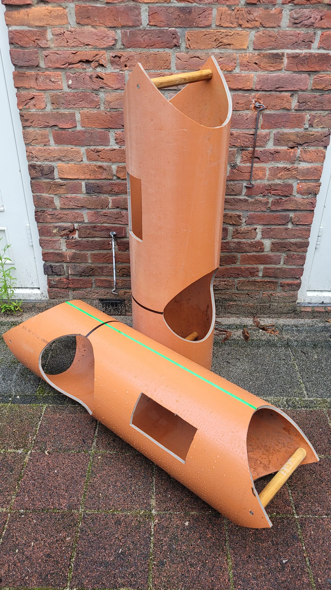
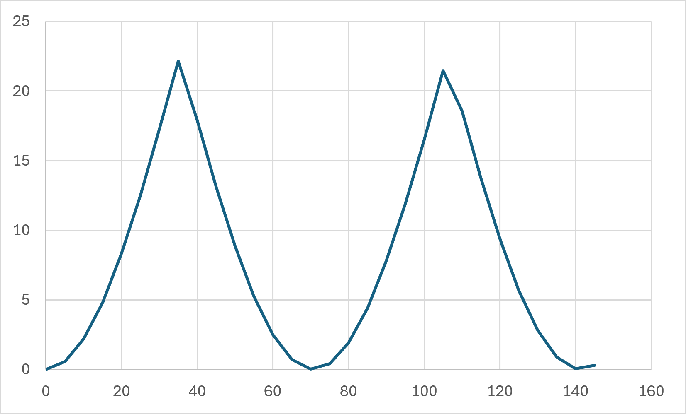
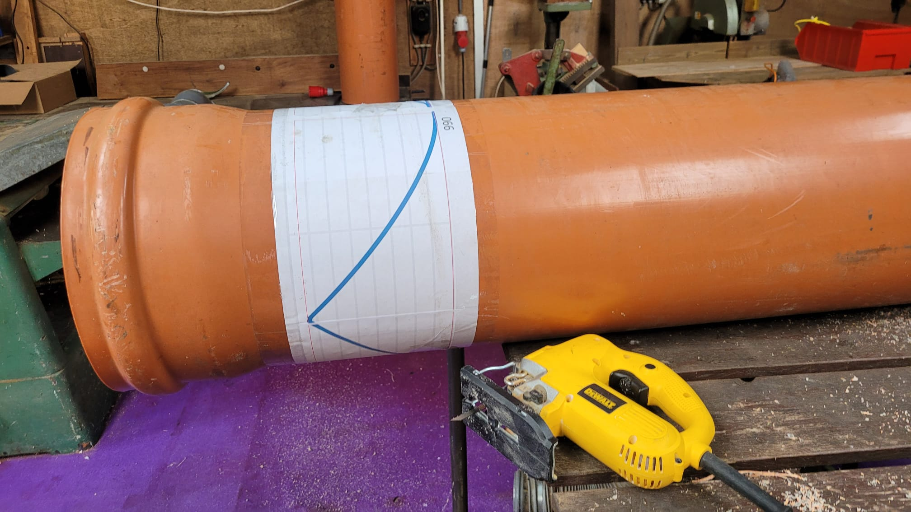
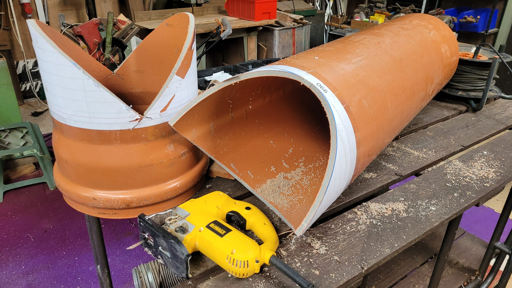
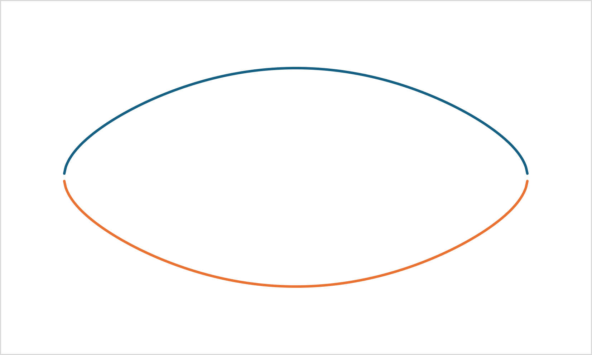
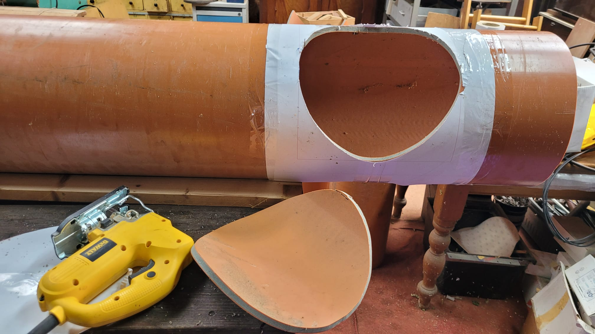
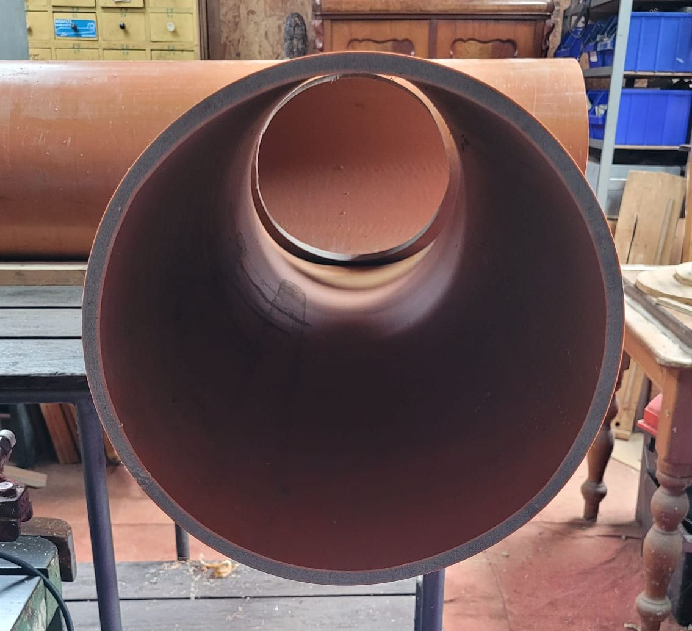

# Uitslagen voor haakse T-verbindingen van ronde buizen

Deze bestanden horen bij het maken van een mal voor een **Koldo Balesko-val** met een **PVC-buis van 315 mm** als vorm. De mal wordt gebruikt om gaasdelen nauwkeurig op elkaar te laten aansluiten:

- een **horizontale buis van 8 mm gaas**;
- twee **verticale buizen van 6 mm gaas**.

De PVC-buis dient hierbij als stevige ronding waarop de vorm kan worden afgetekend, gecontroleerd en passend gemaakt. Met de uitslag van de **vissenmond** wordt het uiteinde van een verticale gaasbuis gevormd, zodat deze netjes tegen de horizontale buis aansluit. Met de uitslag van de **cirkel/opening** wordt bepaald waar en hoe de opening in de horizontale buis moet komen.

In de praktijk worden de papieren uitslagen op of rond de 315 mm PVC-buis gelegd en op ware grootte gebruikt als aftekenmal. Daarna kan het gaas volgens deze lijnen worden geknipt, gebogen en gepast.



## Belangrijk: printbestanden

De PDF-bestanden met **`print`** in de bestandsnaam zijn kant-en-klare printdocumenten op **A4 liggend (landscape)**. Print deze bestanden op **100% / ware grootte**. De losse A4-vellen kunnen daarna met plakband en een kleine overlap worden samengevoegd tot de volledige mal.

De maten voor deze mallen zijn:

| Printbestand | Gebruik | Samengestelde maat |
|---|---|---|
| [`Vissenmond print.pdf`](Vissenmond%20print.pdf) | vissenmond voor een buis Ø315 mm | ontwikkelde omtrek **989,602 mm** |
| [`Cirkel print.pdf`](Cirkel%20print.pdf) | opening in hoofdbuis Ø315 mm voor aftakbuis Ø275 mm | circa **334 mm breed** en **275 mm hoog** |
| [`Rechthoek print.pdf`](Rechthoek%20print.pdf) | invliegopening in de horizontale buis | print op **100% / ware grootte** |

De rechthoekige uitslag is bedoeld voor de **invliegopeningen**. Deze openingen worden **onder de hartlijn van de vliegopening** in de horizontale buis uitgeknipt, ongeveer **om de meter** over de lengte van de buis.

Gebruik bij het samenplakken de overlap alleen om de vellen te verbinden; de maatlijnen van de uitslag blijven leidend.

---

Dit document beschrijft twee veelgebruikte uitslagen voor een **haakse (90°) T-verbinding** van ronde buizen:

1. de **vissenmond** aan het uiteinde van de aansluitende buis;
2. de **opening in de hoofdbuis** waarin de aansluitende buis uitkomt.

De berekeningen zijn opgezet voor gebruik in **Nederlandstalige Excel**. Voor een bruikbare 1:1-uitslag moet in een XY-grafiek **1 mm horizontaal dezelfde schaal hebben als 1 mm verticaal**.

---

# 1. Uitslag vissenmond

Deze uitslag beschrijft de snijlijn aan het uiteinde van een buis met een buitendiameter van **315 mm**. De buis wordt onder **90°** aangesloten op een tweede buis met dezelfde buitendiameter. De uitslag wordt gebruikt om de vissenmond op ware grootte af te tekenen.

## Uitgangspunten voorbeeld

- Buitendiameter beide buizen: **315 mm**
- Straal: **157,5 mm**
- Aansluithoek: **90°**
- Ontwikkelde omtrek: **989,602 mm**

Wanneer de buiswand wordt uitgerold tot een vlakke plaat, wordt de snijlijn van de vissenmond als een periodieke curve zichtbaar.

## Formule

Neem:

- **x** = afstand langs de ontwikkelde omtrek van de buis;
- **y** = uitsnijdiepte vanaf het rechte buiseinde;
- **r** = straal van de buis.

De algemene formule is:

\[
y=r\left(1-\left|\cos\left(\frac{x}{r}\right)\right|\right)
\]

Voor Ø315 mm, met **r = 157,5 mm**:

\[
y=157{,}5\left(1-\left|\cos\left(\frac{x}{157{,}5}\right)\right|\right)
\]

De ontwikkelde lengte van één volledige omtrek is:

\[
L=2\pi r=\pi D
\]

Voor Ø315 mm:

\[
L=989{,}602\ \text{mm}
\]

## Excel-opzet

Gebruik twee kolommen:

| Kolom | Betekenis |
|---|---|
| A | X-positie langs de ontwikkelde omtrek |
| B | Uitsnijdiepte Y |

### Kolom A – X-waarden

Begin bijvoorbeeld in **A2** met:

```excel
=0
```

In **A3**:

```excel
=A2+1
```

Trek deze formule door tot **989,602 mm**. Voor een nauwkeuriger curve kan een stap van **0,5 mm** of **0,1 mm** worden gebruikt.

### Kolom B – vissenmondcurve

Plaats in **B2**:

```excel
=157,5*(1-ABS(COS(A2/157,5)))
```

Trek de formule naar beneden.

## Andere buisdiameter

Voor een andere buitendiameter **D** geldt:

```text
r = D / 2
```

Vervang in de formule **157,5** door de nieuwe straal **r**:

```text
y = r * (1 - ABS(COS(x/r)))
```

De totale ontwikkelde lengte wordt:

```text
L = PI() * D
```

Voorbeeld voor Ø400 mm (**r = 200 mm**):

```excel
=200*(1-ABS(COS(A2/200)))
```

## Grafiek maken

Gebruik in Excel:

**Invoegen → Spreidingsdiagram (XY) → Spreiding met vloeiende lijnen**

Maak één gegevensreeks:

- X = kolom A;
- Y = kolom B.

Gebruik geen gewoon lijndiagram, omdat Excel de X-waarden dan niet als echte afstanden behandelt.

## Grafiek



## Toepassing op de PVC-buis

De vissenmonduitslag kan op ware grootte rond de verticale buis worden gelegd om de zaaglijn af te tekenen.



Na het zagen ontstaat de vissenmondvorm waarmee de verticale buis tegen de horizontale buis kan worden gepast.



## Belangrijk voor een echte 1:1 uitslag

Voor gebruik als afteken- of snijmal moeten de X- en Y-as dezelfde fysieke schaal hebben:

**1 mm horizontaal = 1 mm verticaal.**

Een Excel-grafiek mag daarom niet vrij in breedte of hoogte worden uitgerekt wanneer deze als maatvaste uitslag wordt gebruikt.

---

# 2. Uitslag van de opening in de hoofdbuis

Deze uitslag beschrijft de opening in een **hoofdbuis Ø315 mm** voor een haakse aansluiting van een **aftakbuis Ø275 mm**.

## Uitgangspunten

- Hoofdbuisdiameter: **315 mm**
- Straal hoofdbuis: **157,5 mm**
- Diameter opening / aftakbuis: **275 mm**
- Straal opening / aftakbuis: **137,5 mm**
- Aansluithoek: **90°**

Wanneer de wand van de hoofdbuis wordt uitgerold tot een vlakke plaat, wordt de ronde doorsnijding geen cirkel maar een langgerekte gesloten curve.

## Formule

Neem:

- **x** = afstand over de uitgerolde omtrek van de hoofdbuis, gemeten vanaf het midden van de opening;
- **y** = afstand boven of onder de hartlijn van de opening.

De bovenste curve is:

\[
y=\sqrt{137{,}5^2-157{,}5^2\sin^2(x/157{,}5)}
\]

De onderste curve is:

\[
y=-\sqrt{137{,}5^2-157{,}5^2\sin^2(x/157{,}5)}
\]

De curve bestaat alleen waar de waarde onder de wortel nul of positief is.

## Excel-opzet

Gebruik drie kolommen:

| Kolom | Betekenis |
|---|---|
| A | X-positie over de uitgerolde hoofdbuis |
| B | Bovenste helft van de opening |
| C | Onderste helft van de opening |

### Kolom A – X-waarden

Begin bijvoorbeeld in **A2** met:

```excel
=-167
```

In **A3**:

```excel
=A2+1
```

Trek deze formule door tot ongeveer **+167 mm**. Voor een nauwkeuriger curve kan een stap van **0,5 mm** of **0,1 mm** worden gebruikt.

### Kolom B – bovenste curve

Plaats in **B2**:

```excel
=ALS(137,5^2-157,5^2*SIN(A2/157,5)^2<0;NB();WORTEL(137,5^2-157,5^2*SIN(A2/157,5)^2))
```

### Kolom C – onderste curve

Plaats in **C2**:

```excel
=ALS(137,5^2-157,5^2*SIN(A2/157,5)^2<0;NB();-WORTEL(137,5^2-157,5^2*SIN(A2/157,5)^2))
```

Trek de formules in kolom B en C naar beneden.

`NB()` voorkomt dat Excel punten tekent buiten het geldige bereik van de curve.

## Grafiek maken

Gebruik in Excel:

**Invoegen → Spreidingsdiagram (XY) → Spreiding met vloeiende lijnen**

Maak twee gegevensreeksen:

- Reeks 1: X = kolom A, Y = kolom B;
- Reeks 2: X = kolom A, Y = kolom C.

Gebruik geen gewoon lijndiagram, omdat Excel de X-waarden dan niet als echte afstanden behandelt.

## Grafiek



## Toepassing op de PVC-buis

De cirkeluitslag wordt op de horizontale PVC-buis geplaatst om de opening af te tekenen en uit te zagen.



## Belangrijk voor een echte 1:1 uitslag

Voor gebruik als mal moeten X en Y dezelfde schaal hebben:

**1 mm horizontaal = 1 mm verticaal.**

De opening heeft in het midden een totale hoogte van **275 mm**. De uitgerolde vorm is breder dan 275 mm doordat de doorsnijding over het gekromde oppervlak van de Ø315 mm hoofdbuis wordt ontwikkeld.

---

# 3. Samenvatting

| Toepassing | Hoofdmaten | Excel-reeksen | Resultaat |
|---|---|---:|---|
| Vissenmond | twee gelijke buizen, voorbeeld Ø315 mm | 1 | snijlijn aan het buiseinde |
| Opening hoofdbuis | Ø315 mm hoofdbuis + Ø275 mm aftakbuis | 2 | gesloten uitslag van de opening |

Voor beide uitslagen geldt dat de Excel-grafiek alleen als maatvaste mal kan worden gebruikt wanneer de **X- en Y-schaal identiek** worden ingesteld en de uiteindelijke afdruk op **100% / ware grootte** wordt gemaakt.

## Passing van de buizen

Na het aftekenen en zagen kunnen de buisdelen tegen elkaar worden geplaatst om de vorm en passing te controleren. Deze PVC-vorm dient als basis voor het maken van de uiteindelijke Koldo Balesko-val in gaas.


